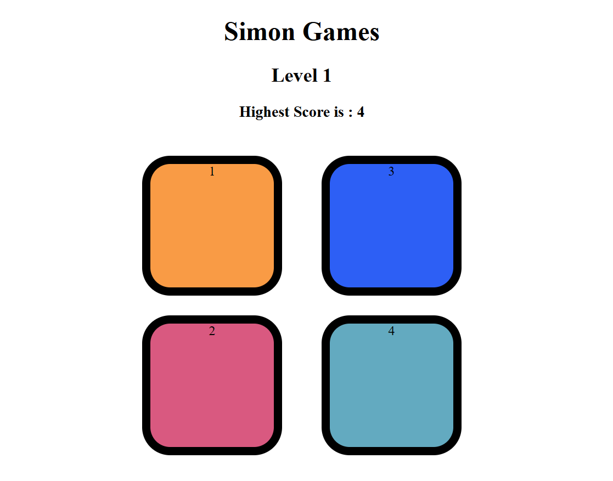

# Simon-Game
A simple Simon Game built with HTML, CSS, and JavaScript. Repeat the color sequence as it grows with each level. Clean design, responsive layout, and full restart functionality after mistakes. A great beginner project to practice DOM and logic.

  

## Technologies Used

- HTML5  
- CSS3  
- JavaScript (Vanilla)

## Features

- Interactive color-based gameplay  
- Random color sequence generation  
- Level tracking  
- Game-over detection with restart  
- Responsive design and simple UI

## How to Play

1. Press any key to start the game.  
2. Watch the color sequence carefully.  
3. Repeat the same sequence by clicking the colored buttons.  
4. Each round adds a new color to the sequence.  
5. If you click the wrong color, the game ends and restarts.

## Project Setup

No installation required. Just open `index.html` in your browser.

## 📄 License

This project is open source and free to use.

---
